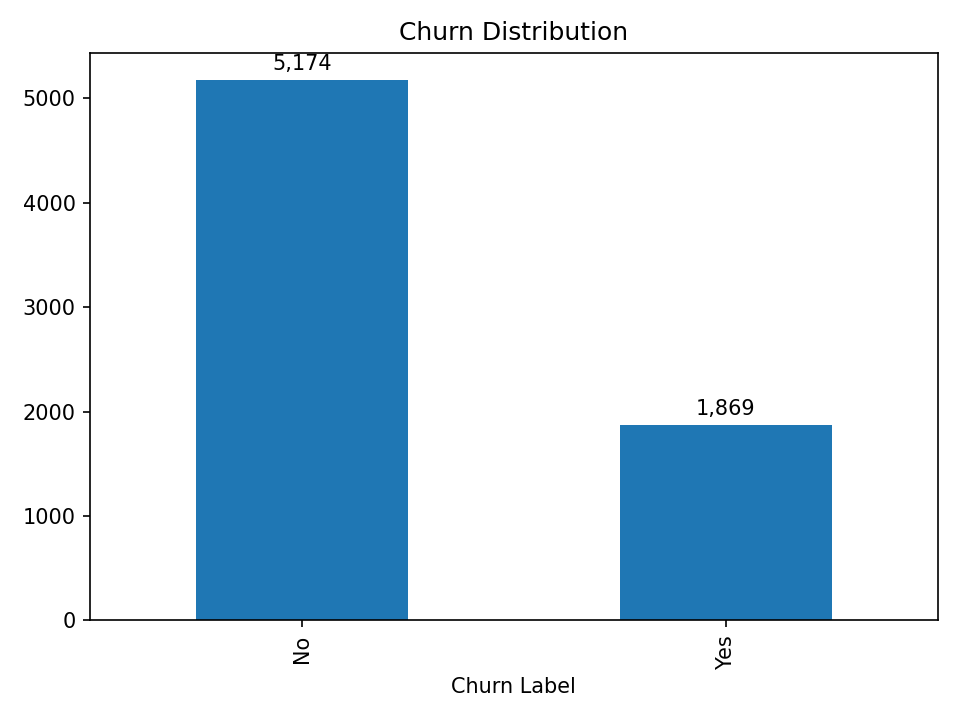
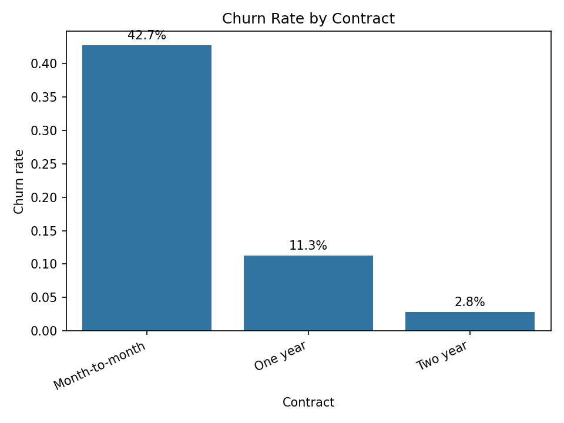
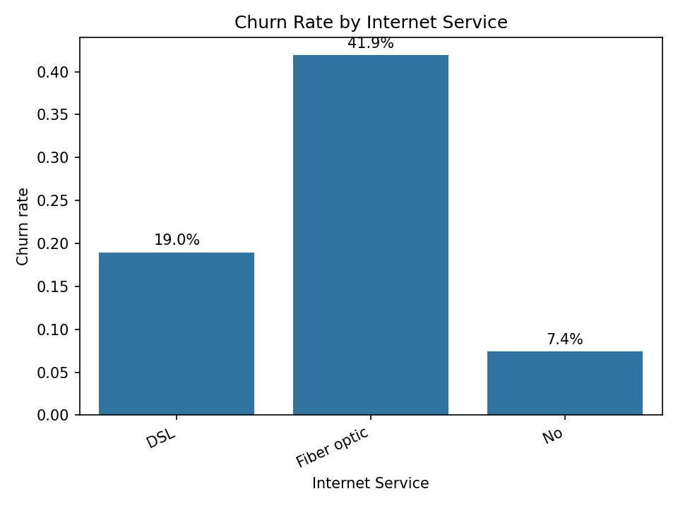
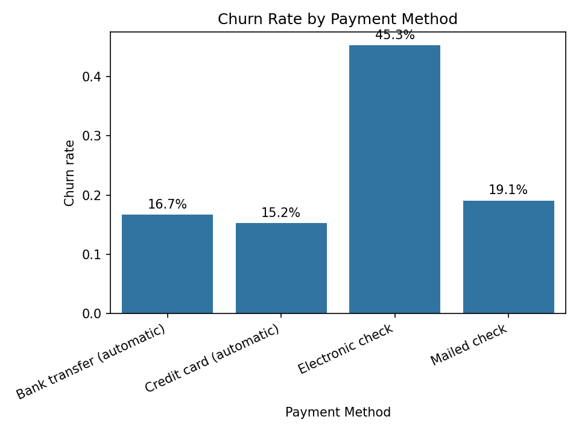
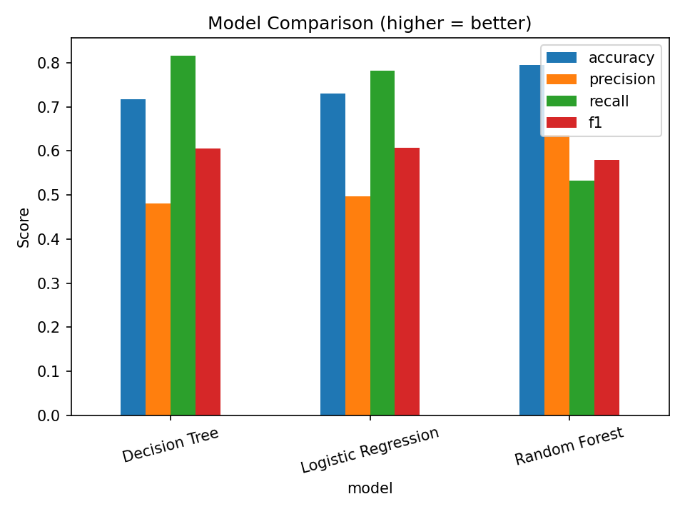

# Telco Customer Churn Analysis

Customer churn is a core challenge in telecom. Retaining existing subscribers is cheaper than acquiring new ones.  
This project explores the **IBM Telco Customer Churn dataset** to surface churn drivers and test simple predictive models.

---

##  Project Overview
- **Dataset**: IBM Telco Customer Churn (~7k customers; demographics, services, contracts, charges).  
- **Goal**: Understand *why* customers leave and build baseline models to flag at-risk customers.  
- **What’s inside**:
  1) EDA → churn by **contract**, **internet service**, **payment method**, and **tenure**  
  2) Baseline ML → **Logistic Regression**, **Decision Tree**, **Random Forest** (no heavy tuning)  
  3) Business actions you can take from the patterns

---

##  Key Insights

### Churn distribution


- ~27% churn (class imbalance to consider in modeling).
- Risk is concentrated in **month-to-month** contracts.

### Churn by contract


- **Month-to-month** customers churn at ~3× the rate of 1–2 year contracts → lock-in and incentives matter.

### Churn by internet service


- **Fiber optic** users show higher churn than DSL → investigate price/experience drivers.

### Churn by payment method


- **Electronic check** users churn more than auto-pay users → payment friction likely contributes.

---

##  Baseline Modeling Results

To avoid leakage, we **removed**: `Churn Score`, `Churn Value`, `CLTV`, `Churn Reason`, and IDs.

| Model               | Accuracy | Precision | Recall | F1   |
|---------------------|----------|-----------|--------|------|
| Decision Tree       | 0.717    | 0.481     | **0.816** | 0.605 |
| Logistic Regression | 0.731    | 0.497     | **0.783** | 0.608 |
| Random Forest       | **0.795** | **0.636** | 0.532 | 0.579 |



**Interpretation**
- Tree/LogReg achieve **higher recall** → catch more potential churners (useful for retention outreach).  
- Random Forest is **more precise** but misses more churners.  
- In churn prevention, we often favor **recall** (better to flag extra customers than miss true churners).

---

##  Recommended Actions
- **Contract strategy**: Target **month-to-month** with incentives to switch to annual plans.  
- **Early-tenure focus**: Proactive onboarding in the first 3–6 months.  
- **Service quality**: Audit fiber optic tickets/NPS/outages; fix top pain points.  
- **Payment friction**: Encourage **auto-pay** with small credits/fee waivers.

---

##  Business Impact

This analysis highlights key churn drivers and provides actionable recommendations:

- **Contract Type**: Month-to-month customers churn at ~3x the rate of longer-term contracts.  
  → Action: Incentivize annual/2-year plans with discounts or perks.  

- **Internet Service**: Fiber optic users churn more than DSL.  
  → Action: Audit fiber service quality (tickets, NPS) to reduce dissatisfaction.  

- **Payment Method**: Customers paying via electronic check have the highest churn rate.  
  → Action: Promote auto-pay/credit card by offering small fee waivers.  

 **Value to the business**:  
Reducing churn by even **5% saves millions in customer acquisition costs** and stabilizes revenue.

---

###  Strategic Value
- By reducing churn among high-risk groups (e.g., month-to-month, high charges, electronic check), the company could **lower churn by 5–10%**.  
- Even a **5% reduction** would retain ~350 customers and preserve **~$300k annually**, equaling to a approximate **~5% of total annual revenue** for a company of this scale.

---

##  How to Run

```bash
# 1) clone
git clone git@github.com:AnkitWalimbe/churn_telco.git
cd churn_telco

# 2) install deps
pip install -r requirements.txt

# 3) get data (Kaggle) and place here:
#    data/Telco_Customer_Churn.xlsx
#    (the notebook also supports a CSV version)

# 4) open the notebook
jupyter notebook notebooks/01_churn_telco.ipynb

